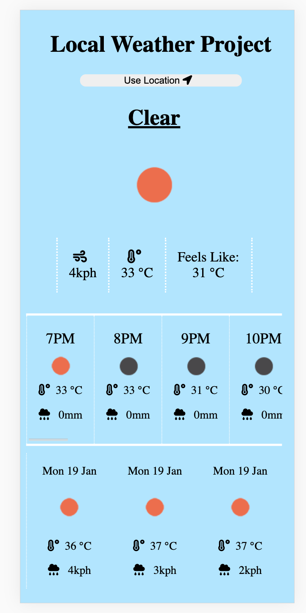

### React Weather App ###

Bootstrapped with Create-React-App

Simple weather proejct using the users current location.  The purpose fo the projecty was to strengtehen my react API knowledge, create a back end and learn the very simple javascript geoloaction feature.

App still needs styling, all the functinality is there, it just looks very basic at the moment

To use this app you will need an Opne weather API key saved in a .ENV file as REACT_APP_GOOGLE_API_KEY

Tech used:
 - React
 - React Hooks
 - Vanilla JS
 - Node and Express
 - Open Weather API

 	